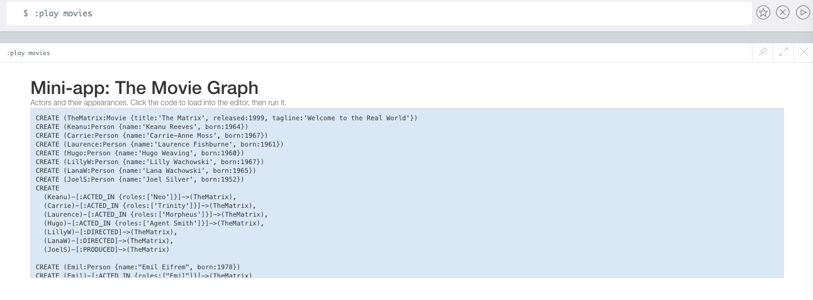

## Getting started with the Neo4j PHP OGM

This quick start guide covers the basics of working with the PHP OGM. At the end you should be able to :

* Install and configure the PHP OGM
* Map PHP objects to Neo4j nodes and relationships
* Use the `EntityManager` to save, load and delete objects in the database

### What is the Neo4j PHP OGM ?

The Neo4j PHP OGM is an **object graph mapper** for PHP5.6+ that provides persistence for PHP objects.
It is heavily inspired by the [Doctrine2](http://www.doctrine-project.org/) project and uses the data mapper pattern 
and dockblock annotations.

### What are entities ?

Entities are PHP objects that can be identified by a unique identifier and represent nodes or relationships in your database.

In contrary to object relational mapper, the Neo4j PHP OGM supports two types of entities : 

* PHP Objects representing **Nodes** in your database
* PHP Objects representing **Relationships** in your datase (named _RelationshipEntity_)

### An example model : The movie database

For this getting started guide, we will implement the Movie Graph model that is available in any Neo4j installation by 
issuing the `:play movies` command in the Neo4j browser.



Having a look at the data model, we can assume the following requirements :

* A _Person_ has a name and a born properties

* A _Person_ can have **ACTED_IN** or **DIRECTED** a _Movie_

* A _Movie_ has a title, a tagline and a release year properties


### Project setup
 
Create a new empty folder for this tutorial project (eg: neo4j-php-ogm-movies) and create a new `composer.json` file :

```json
{
  "require": {
    "graphaware/neo4j-php-ogm": "@rc"
  },
  "autoload": {
    "psr-4": {"Demo\\": "src/"}
  }
}
```

Install the Neo4j PHP OGM by using the Composer command line tool : 

```bash
composer install
```

Create the `src/` directory:

```bash
neo4j-php-ogm-movies
|--src
|--vendor
```

### Creating the EntityManager

The Neo4j PHP OGM public interface is the EntityManager, providing the point of entry to the lifcecyle management
of your entities and maps them from and back the database.

```php
// bootstrap.php
<?php

use GraphAware\Neo4j\OGM\EntityManager;

require_once 'vendor/autoload.php';

$entityManager = EntityManager::create('http://localhost:7474');
```

The argument passed to the factory method of the EntityManager is the connection detail of your Neo4j instance.

### Starting with the Person entity

Let's start with the first entity, the Person. Create a `src/Person.php` class that will contain the `Person` entity definition :

```php
<?php

namespace Demo;

// src/Person.php

class Person
{
    /**
     * @var int
     */
    protected $id;

    /**
     * @var string
     */
    protected $name;

    /**
     * @var int
     */
    protected $born;

    /**
     * @return int
     */
    public function getId()
    {
        return $this->id;
    }

    /**
     * @return string
     */
    public function getName()
    {
        return $this->name;
    }

    /**
     * @param string $name
     */
    public function setName($name)
    {
        $this->name = $name;
    }

    /**
     * @return int
     */
    public function getBorn()
    {
        return $this->born;
    }

    /**
     * @param int $born
     */
    public function setBorn($born)
    {
        $this->born = $born;
    }
}
```


The next step is to apply the metadata that will define how your entities, their properties and references should be mapped to the
database. Metadata for entities is defined using docblock annotations :

```php
<?php

namespace Demo;

use GraphAware\Neo4j\OGM\Annotations as OGM;

// src/Person.php

/**
 *
 * @OGM\Node(label="Person")
 */
class Person
{
    /**
     * @var int
     * 
     * @OGM\GraphId()
     */
    protected $id;

    /**
     * @var string
     * 
     * @OGM\Property(type="string")
     */
    protected $name;

    /**
     * @var int
     * 
     * @OGM\Property(type="int")
     */
    protected $born;
    
    // other code
```

The top-level `Node` definition tag defines that the entity represents a node in the database. The `Person#name` and `Person#born`
are defined as `property` attributes. The `id` represents the internal neo4j identifier.

Now let's create a new script that will create a new person into our database :

```php
<?php

use Demo\Person;

require_once 'bootstrap.php';

$newPersonName = $argv[1];
$newPersonBorn = (int) $argv[2];

$person = new Person();
$person->setName($newPersonName);
$person->setBorn($newPersonBorn);

$entityManager->persist($person);
$entityManager->flush();

echo sprintf('Created Person with ID "%d"', $person->getId());
```

```bash
$/demo-ogm-movies> php create-person.php Michael 40
Created Person with ID "2004"
```

If you inspect the database by using the Neo4j browser or the `cypher-shell`, you can see that a Person node has been created :

```bash
$/neo4j-ogm-demo> ./bin/cypher-shell
Connected to Neo4j 3.1.0 at bolt://localhost:7687.
Type :help for a list of available commands or :exit to exit the shell.
Note that Cypher queries must end with a semicolon.
neo4j> MATCH (n:Person) WHERE id(n) = 2004 RETURN n;
n
(:Person {born: 40, name: "Michael"})
neo4j>
```

What is happening under the hood ? Using the `Person` object seems pretty familiar to nowaydays OOP developments. The interesting part 
is the usage of the EntityManager.

To notify the EntityManager that a new entity should be persisted in the database, you have to call the `persist()` method and then call `flush()` 
in order to initiate the transaction against the database.

As in Doctrine, the Neo4j PHP OGM follows the UnitOfWork pattern which detects all entities that were fetched and have changed during the lifetime 
of the request.


The next step is to create a script for fetching all persons :

```php
<?php

require_once 'bootstrap.php';

$personsRepository = $entityManager->getRepository(\Demo\Person::class);
$persons = $personsRepository->findAll();

foreach ($persons as $person) {
    echo sprintf("- %s\n", $person->getName());
}
```

```bash
$/demo-ogm-movies> php list-persons.php
- Keanu Reeves
- Carrie-Anne Moss
- Laurence Fishburne
- Hugo Weaving
- Lilly Wachowski
- Lana Wachowski
- Joel Silver
...
```